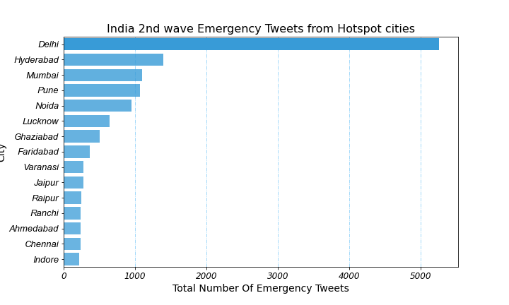
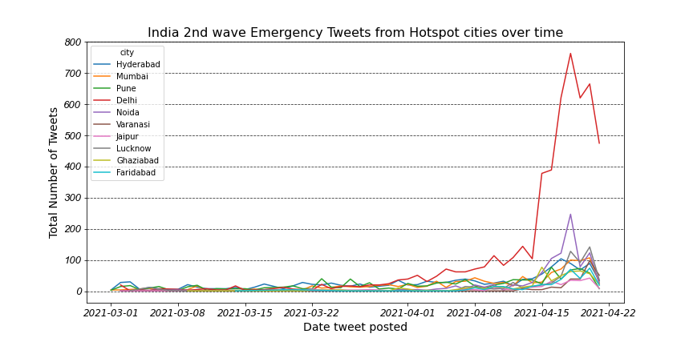

# Covid19-tweeter-web-app
## This repository contains all the information including source code of my web-application, it's open for everyone, Happy learning!

### This project took me about 4 days to complete, first I got an idea to scrape the tweets which mentions 'urgent', 'sos', 'emergency' and "help' from one of my fiverr client. But he wasn't clear enough what to do with that, so conversation went nowhere. Then I had the data, so I created some graphs which are given below. I posted the graph onto [LinkedIn](https://www.linkedin.com/posts/aditya-rajgor_datascience-stayhomestaysafe-indiafightscorona-activity-6790899052675379200-Sb5Z) and thought I should write article about how many people are requiring for the covid19 help.

### After posting this I saw this [linkedin post](https://www.linkedin.com/posts/sarthakrastogi_india-covid-oxygencylinder-ugcPost-6791260741539381248-U3DV), which was using same kind of data but with really great usecase! It was a simple web-app which gives contact information of help providers. And I was like how the heck I didn't think this way. After that It took me about two days to deploy this amazing web-application, which is indeed better. 

- #### It is really accurate
- #### it has option for helpers who wants to give medical equipment to the nearer patient
- #### it has options for selecting dates and equipment
- #### it has options to select number of tweets 
- #### and has nice beautiful UI and theme

### New things I've learned
- #### Snscrape Library
- #### Tweeter developer API
- #### Streamlit
- #### Heroky with Github way of deployment
- #### Some new usecases of html tags

### Problems I have faced
- Snscrape doesn't work on heroku
- Mailing link doesn't redircting to my mail address 
- there is a scraping limit in the api
- forgot to add video to my linkedin post
- It isn't necessary that you get attention for your effort

### main.py is the web-app python file with snscrape librar, you can run it locally.
### India_2nd_wave_analysis.ipynb is for generating the below graphs

 

## Contact Me for any bug report or feedback
- [LinkedIn](https://www.linkedin.com/in/aditya-rajgor/)
- <a href = "mailto:adityarajgor88@gmail.com?subject=Feedback regarding web-app&body=Thanks for considering,...">Mail</a>
- [Working demo](https://www.loom.com/share/3c2d3eda08d04f7c9c9bfae0ab1bdf08)

## Goodlcuk with your errors, until then peace !
